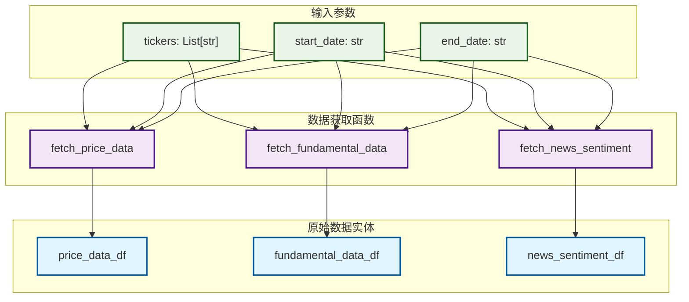
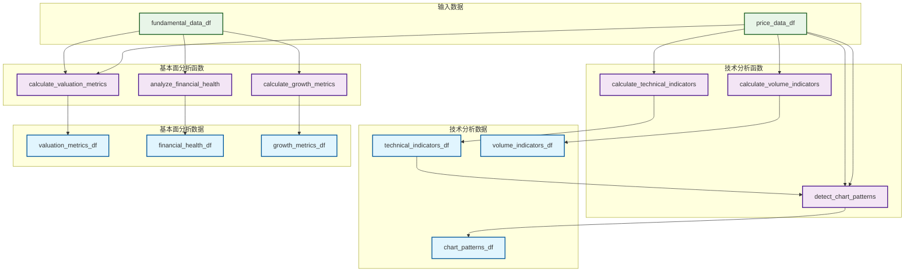
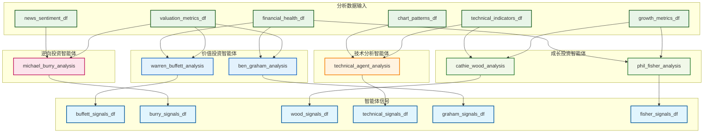
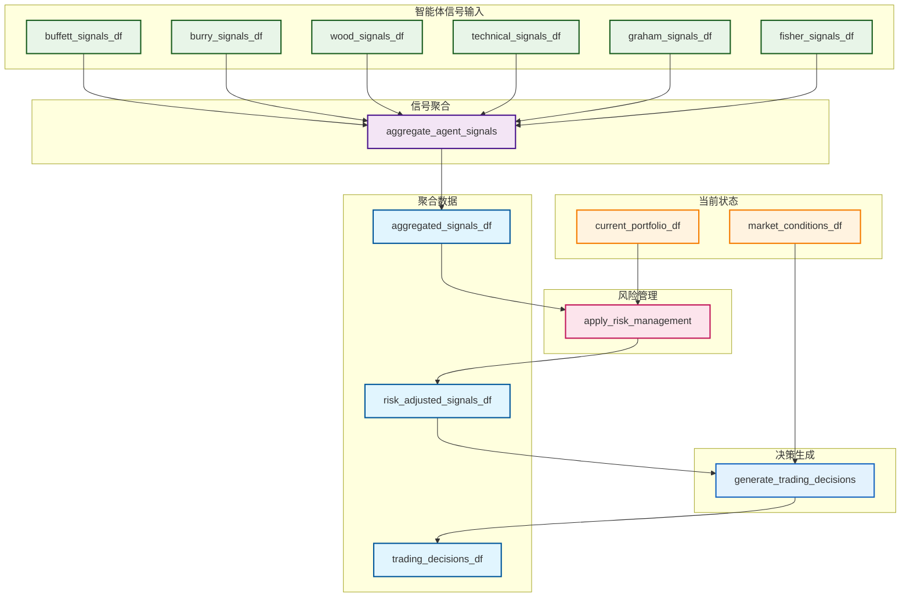
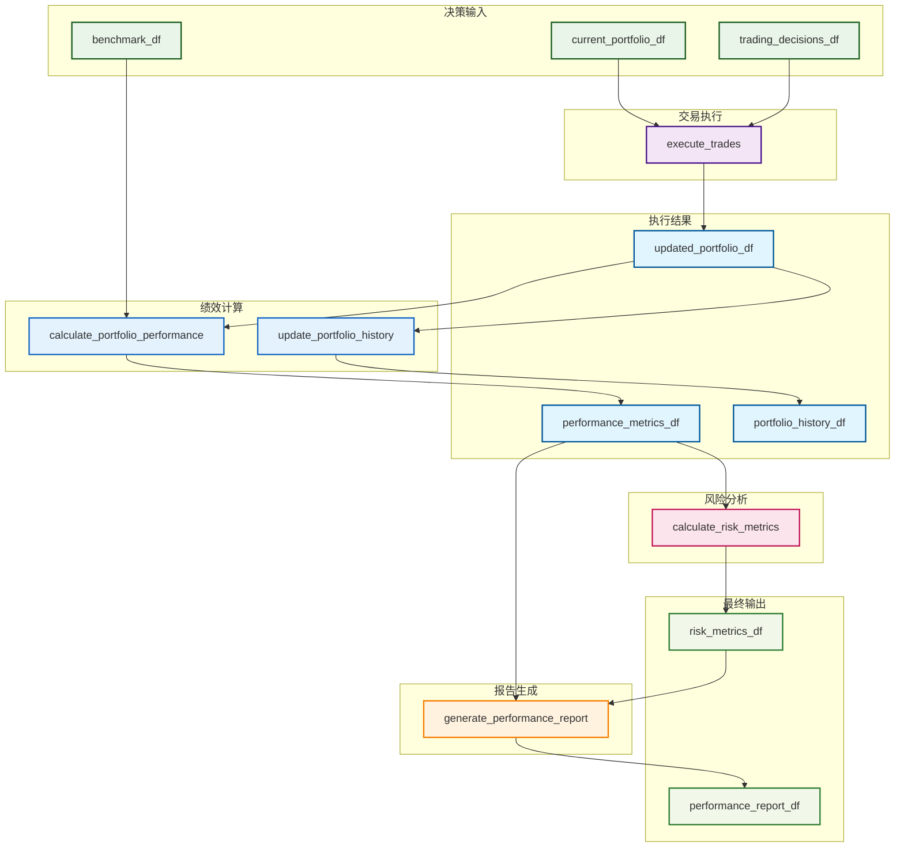
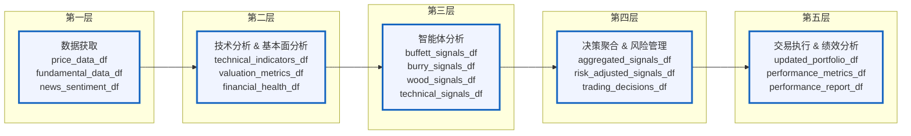
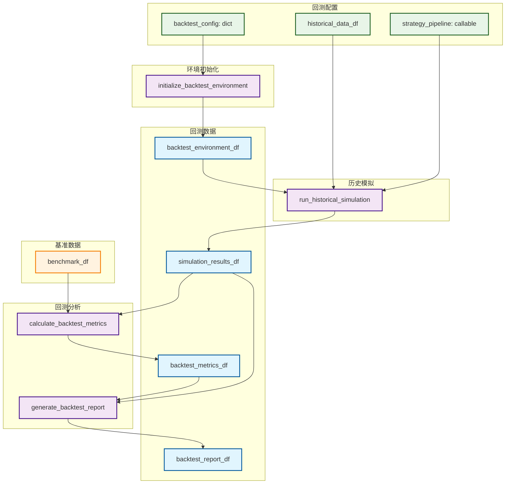
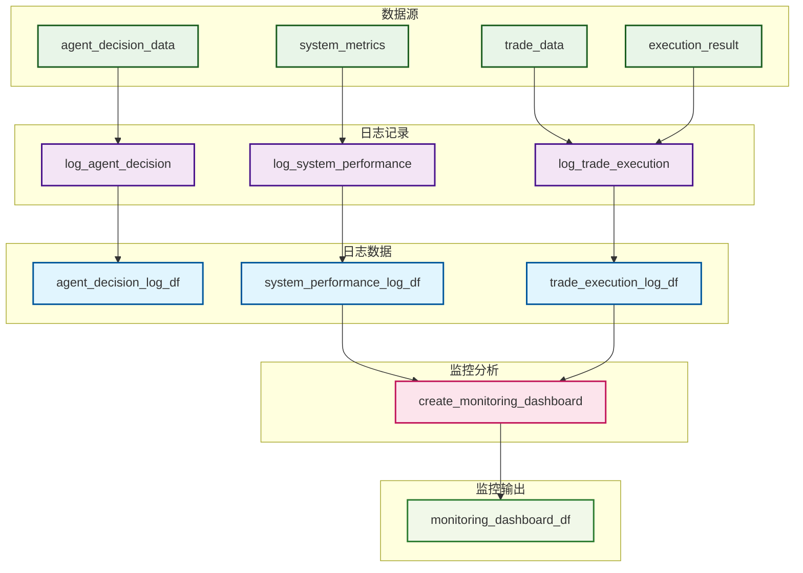
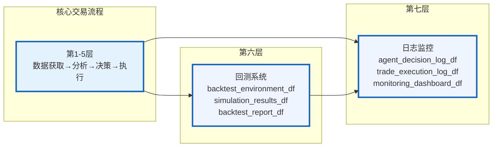

# AI对冲基金项目数据结构定义

## 概述

本文档基于项目数据流图，详细定义了AI对冲基金系统中的重要数据结构，并提供了使用pandas DataFrame进行存储和转换的建议。

## 核心数据结构

### 1. AgentState (智能体状态)

#### 结构定义
```python
class AgentState(TypedDict):
    messages: Sequence[BaseMessage]  # 消息序列
    data: dict[str, any]            # 共享数据
    metadata: dict[str, any]        # 元数据
```

#### DataFrame存储建议
```python
# agent_states_df
columns = [
    'agent_id',           # 智能体ID
    'timestamp',          # 时间戳
    'message_type',       # 消息类型
    'message_content',    # 消息内容
    'data_key',          # 数据键
    'data_value',        # 数据值
    'metadata_key',      # 元数据键
    'metadata_value'     # 元数据值
]
```

### 2. Portfolio (投资组合)

#### 结构定义
```python
portfolio = {
    "cash": float,                  # 现金余额
    "margin_requirement": float,    # 保证金要求
    "positions": {                  # 持仓信息
        ticker: {
            "long": int,            # 多头股数
            "short": int,           # 空头股数
            "long_cost_basis": float,   # 多头成本基础
            "short_cost_basis": float,  # 空头成本基础
        }
    },
    "realized_gains": dict          # 已实现收益
}
```

#### DataFrame存储建议
```python
# portfolio_df
columns = [
    'portfolio_id',       # 投资组合ID
    'timestamp',          # 时间戳
    'cash',              # 现金余额
    'margin_requirement', # 保证金要求
    'total_value',       # 总价值
    'unrealized_pnl',    # 未实现盈亏
    'realized_pnl'       # 已实现盈亏
]

# positions_df
columns = [
    'portfolio_id',       # 投资组合ID
    'ticker',            # 股票代码
    'timestamp',         # 时间戳
    'long_shares',       # 多头股数
    'short_shares',      # 空头股数
    'long_cost_basis',   # 多头成本基础
    'short_cost_basis',  # 空头成本基础
    'current_price',     # 当前价格
    'market_value',      # 市场价值
    'unrealized_pnl'     # 未实现盈亏
]
```

### 3. HedgeFundFlow (流程配置)

#### 结构定义
```python
class HedgeFundFlow:
    id: str                    # 流程ID
    name: str                  # 流程名称
    description: str           # 流程描述
    nodes: List[dict]          # 节点配置
    edges: List[dict]          # 边配置
    data: dict                 # 流程数据
    tags: List[str]            # 标签
    created_at: datetime       # 创建时间
    updated_at: datetime       # 更新时间
```

#### DataFrame存储建议
```python
# flows_df
columns = [
    'flow_id',           # 流程ID
    'name',              # 流程名称
    'description',       # 流程描述
    'tags',              # 标签（JSON字符串）
    'created_at',        # 创建时间
    'updated_at',        # 更新时间
    'is_active'          # 是否激活
]

# flow_nodes_df
columns = [
    'flow_id',           # 流程ID
    'node_id',           # 节点ID
    'node_type',         # 节点类型
    'agent_name',        # 智能体名称
    'position_x',        # X坐标
    'position_y',        # Y坐标
    'config'             # 节点配置（JSON字符串）
]

# flow_edges_df
columns = [
    'flow_id',           # 流程ID
    'edge_id',           # 边ID
    'source_node',       # 源节点
    'target_node',       # 目标节点
    'edge_type'          # 边类型
]
```

### 4. HedgeFundFlowRun (运行记录)

#### 结构定义
```python
class HedgeFundFlowRun:
    id: str                    # 运行ID
    flow_id: str               # 流程ID
    status: str                # 运行状态
    start_time: datetime       # 开始时间
    end_time: datetime         # 结束时间
    initial_portfolio: dict    # 初始投资组合
    final_portfolio: dict      # 最终投资组合
    performance_metrics: dict  # 绩效指标
    error_message: str         # 错误信息
```

#### DataFrame存储建议
```python
# flow_runs_df
columns = [
    'run_id',            # 运行ID
    'flow_id',           # 流程ID
    'status',            # 运行状态
    'start_time',        # 开始时间
    'end_time',          # 结束时间
    'duration_seconds',  # 运行时长
    'total_return',      # 总收益率
    'sharpe_ratio',      # 夏普比率
    'max_drawdown',      # 最大回撤
    'win_rate',          # 胜率
    'error_message'      # 错误信息
]
```

### 5. HedgeFundFlowRunCycle (分析周期)

#### 结构定义
```python
class HedgeFundFlowRunCycle:
    id: str                    # 周期ID
    run_id: str                # 运行ID
    cycle_number: int          # 周期编号
    timestamp: datetime        # 时间戳
    market_data: dict          # 市场数据
    agent_signals: dict        # 智能体信号
    trading_decisions: dict    # 交易决策
    portfolio_changes: dict    # 投资组合变化
    api_costs: float           # API成本
```

#### DataFrame存储建议
```python
# run_cycles_df
columns = [
    'cycle_id',          # 周期ID
    'run_id',            # 运行ID
    'cycle_number',      # 周期编号
    'timestamp',         # 时间戳
    'total_api_cost',    # 总API成本
    'processing_time',   # 处理时间
    'data_quality_score' # 数据质量评分
]

# agent_signals_df
columns = [
    'cycle_id',          # 周期ID
    'agent_name',        # 智能体名称
    'ticker',            # 股票代码
    'signal_type',       # 信号类型（BUY/SELL/HOLD）
    'confidence',        # 置信度
    'reasoning',         # 推理过程
    'timestamp'          # 时间戳
]

# trading_decisions_df
columns = [
    'cycle_id',          # 周期ID
    'ticker',            # 股票代码
    'action',            # 交易动作
    'quantity',          # 交易数量
    'price',             # 交易价格
    'timestamp',         # 时间戳
    'execution_status'   # 执行状态
]
```

## 数据流相关结构

### 6. 市场数据结构

#### 历史价格数据
```python
# price_data_df
columns = [
    'ticker',            # 股票代码
    'date',              # 日期
    'open',              # 开盘价
    'high',              # 最高价
    'low',               # 最低价
    'close',             # 收盘价
    'volume',            # 成交量
    'adjusted_close'     # 复权收盘价
]
```

#### 基本面数据
```python
# fundamental_data_df
columns = [
    'ticker',            # 股票代码
    'date',              # 日期
    'revenue',           # 营收
    'net_income',        # 净利润
    'total_assets',      # 总资产
    'total_debt',        # 总债务
    'book_value',        # 账面价值
    'shares_outstanding', # 流通股数
    'pe_ratio',          # 市盈率
    'pb_ratio',          # 市净率
    'debt_to_equity',    # 债务权益比
    'roe',               # 净资产收益率
    'roa'                # 总资产收益率
]
```

#### 技术指标数据
```python
# technical_indicators_df
columns = [
    'ticker',            # 股票代码
    'date',              # 日期
    'sma_20',            # 20日简单移动平均
    'sma_50',            # 50日简单移动平均
    'ema_12',            # 12日指数移动平均
    'ema_26',            # 26日指数移动平均
    'macd',              # MACD
    'macd_signal',       # MACD信号线
    'rsi',               # 相对强弱指数
    'bollinger_upper',   # 布林带上轨
    'bollinger_lower',   # 布林带下轨
    'volume_sma',        # 成交量移动平均
    'atr'                # 平均真实波幅
]
```

### 7. 绩效指标结构

```python
# performance_metrics_df
columns = [
    'run_id',            # 运行ID
    'metric_name',       # 指标名称
    'metric_value',      # 指标值
    'benchmark_value',   # 基准值
    'calculation_date',  # 计算日期
    'period_type'        # 周期类型（daily/monthly/yearly）
]

# detailed_performance_df
columns = [
    'run_id',            # 运行ID
    'date',              # 日期
    'portfolio_value',   # 投资组合价值
    'daily_return',      # 日收益率
    'cumulative_return', # 累计收益率
    'benchmark_return',  # 基准收益率
    'alpha',             # 阿尔法
    'beta',              # 贝塔
    'volatility',        # 波动率
    'drawdown'           # 回撤
]
```

### 8. 智能体推理过程结构

```python
# agent_reasoning_df
columns = [
    'cycle_id',          # 周期ID
    'agent_name',        # 智能体名称
    'ticker',            # 股票代码
    'reasoning_step',    # 推理步骤
    'input_data',        # 输入数据
    'analysis_result',   # 分析结果
    'confidence_score',  # 置信度评分
    'processing_time',   # 处理时间
    'llm_model_used',    # 使用的LLM模型
    'token_count',       # Token数量
    'api_cost'           # API成本
]
```

## 数据转换建议

### 1. 嵌套字典到DataFrame转换

```python
def portfolio_to_dataframe(portfolio_dict, portfolio_id, timestamp):
    """将投资组合字典转换为DataFrame格式"""
    
    # 主投资组合信息
    portfolio_df = pd.DataFrame([{
        'portfolio_id': portfolio_id,
        'timestamp': timestamp,
        'cash': portfolio_dict['cash'],
        'margin_requirement': portfolio_dict['margin_requirement'],
        'total_value': calculate_total_value(portfolio_dict),
        'unrealized_pnl': calculate_unrealized_pnl(portfolio_dict),
        'realized_pnl': sum(portfolio_dict['realized_gains'].values())
    }])
    
    # 持仓信息
    positions_data = []
    for ticker, position in portfolio_dict['positions'].items():
        positions_data.append({
            'portfolio_id': portfolio_id,
            'ticker': ticker,
            'timestamp': timestamp,
            'long_shares': position['long'],
            'short_shares': position['short'],
            'long_cost_basis': position['long_cost_basis'],
            'short_cost_basis': position['short_cost_basis']
        })
    
    positions_df = pd.DataFrame(positions_data)
    
    return portfolio_df, positions_df
```

### 2. 时间序列数据处理

```python
def create_time_series_index(df, date_column='date'):
    """为时间序列数据创建索引"""
    df[date_column] = pd.to_datetime(df[date_column])
    df.set_index(date_column, inplace=True)
    return df.sort_index()

def resample_data(df, frequency='D'):
    """重采样数据到指定频率"""
    return df.resample(frequency).last()
```

### 3. 多维数据透视

```python
def create_returns_matrix(signals_df):
    """创建智能体信号矩阵"""
    return signals_df.pivot_table(
        index='timestamp',
        columns=['agent_name', 'ticker'],
        values='confidence',
        fill_value=0
    )

def create_performance_summary(performance_df):
    """创建绩效汇总表"""
    return performance_df.groupby('run_id').agg({
        'total_return': 'last',
        'sharpe_ratio': 'last',
        'max_drawdown': 'min',
        'volatility': 'last'
    })
```

### 4. 数据质量检查

```python
def validate_data_quality(df, required_columns):
    """验证数据质量"""
    quality_report = {
        'missing_columns': set(required_columns) - set(df.columns),
        'null_counts': df.isnull().sum(),
        'duplicate_rows': df.duplicated().sum(),
        'data_types': df.dtypes.to_dict()
    }
    return quality_report

def clean_financial_data(df):
    """清理金融数据"""
    # 移除异常值
    numeric_columns = df.select_dtypes(include=[np.number]).columns
    for col in numeric_columns:
        Q1 = df[col].quantile(0.25)
        Q3 = df[col].quantile(0.75)
        IQR = Q3 - Q1
        lower_bound = Q1 - 1.5 * IQR
        upper_bound = Q3 + 1.5 * IQR
        df[col] = df[col].clip(lower_bound, upper_bound)
    
    return df
```

## 存储优化建议

### 1. 分区策略

```python
# 按日期分区存储大量历史数据
def save_partitioned_data(df, base_path, partition_column='date'):
    """按分区保存数据"""
    df['year'] = df[partition_column].dt.year
    df['month'] = df[partition_column].dt.month
    
    for (year, month), group in df.groupby(['year', 'month']):
        path = f"{base_path}/year={year}/month={month:02d}/data.parquet"
        group.drop(['year', 'month'], axis=1).to_parquet(path)
```

### 2. 数据压缩

```python
# 使用合适的数据类型减少内存使用
def optimize_dtypes(df):
    """优化数据类型"""
    for col in df.columns:
        if df[col].dtype == 'object':
            try:
                df[col] = pd.to_numeric(df[col], downcast='integer')
            except:
                pass
        elif df[col].dtype == 'float64':
            df[col] = pd.to_numeric(df[col], downcast='float')
        elif df[col].dtype == 'int64':
            df[col] = pd.to_numeric(df[col], downcast='integer')
    
    return df
```

### 3. 索引策略

```python
# 创建多级索引提高查询性能
def create_multi_index(df, index_columns):
    """创建多级索引"""
    return df.set_index(index_columns).sort_index()

# 示例：为价格数据创建多级索引
price_data_df = price_data_df.set_index(['ticker', 'date']).sort_index()
```

## 数据访问模式

### 1. 查询优化

```python
class DataAccessLayer:
    """数据访问层"""
    
    def __init__(self, data_path):
        self.data_path = data_path
        self.cache = {}
    
    def get_price_data(self, tickers, start_date, end_date):
        """获取价格数据"""
        key = f"price_{hash((tuple(tickers), start_date, end_date))}"
        if key not in self.cache:
            # 从存储中加载数据
            df = pd.read_parquet(f"{self.data_path}/price_data.parquet")
            df = df[
                (df['ticker'].isin(tickers)) &
                (df['date'] >= start_date) &
                (df['date'] <= end_date)
            ]
            self.cache[key] = df
        return self.cache[key]
    
    def get_agent_signals(self, run_id, cycle_range=None):
        """获取智能体信号"""
        df = pd.read_parquet(f"{self.data_path}/agent_signals.parquet")
        df = df[df['run_id'] == run_id]
        if cycle_range:
            df = df[df['cycle_number'].between(*cycle_range)]
        return df
```

### 2. 实时数据更新

```python
def update_portfolio_data(portfolio_df, new_portfolio_data):
    """更新投资组合数据"""
    new_df = pd.DataFrame([new_portfolio_data])
    return pd.concat([portfolio_df, new_df], ignore_index=True)

def append_market_data(existing_df, new_data):
    """追加市场数据"""
    new_df = pd.DataFrame(new_data)
    combined_df = pd.concat([existing_df, new_df], ignore_index=True)
    return combined_df.drop_duplicates(subset=['ticker', 'date']).sort_values(['ticker', 'date'])
```

## 函数式数据流Pipeline

### 数据实体和函数签名定义

基于函数式编程思想，将数据处理过程组织为纯函数的pipeline，每个函数接收特定的DataFrame输入并产生新的DataFrame输出。

#### 1. 原始数据获取函数

```python
def fetch_price_data(tickers: List[str], start_date: str, end_date: str) -> pd.DataFrame:
    """获取原始价格数据 -> price_data_df"""

def fetch_fundamental_data(tickers: List[str], start_date: str, end_date: str) -> pd.DataFrame:
    """获取基本面数据 -> fundamental_data_df"""

def fetch_news_sentiment(tickers: List[str], start_date: str, end_date: str) -> pd.DataFrame:
    """获取新闻情感数据 -> news_sentiment_df"""
```

#### 2. 技术分析函数

```python
def calculate_technical_indicators(price_df: pd.DataFrame) -> pd.DataFrame:
    """price_data_df -> technical_indicators_df"""

def calculate_volume_indicators(price_df: pd.DataFrame) -> pd.DataFrame:
    """price_data_df -> volume_indicators_df"""

def detect_chart_patterns(price_df: pd.DataFrame, technical_df: pd.DataFrame) -> pd.DataFrame:
    """price_data_df + technical_indicators_df -> chart_patterns_df"""
```

#### 3. 基本面分析函数

```python
def calculate_valuation_metrics(fundamental_df: pd.DataFrame, price_df: pd.DataFrame) -> pd.DataFrame:
    """fundamental_data_df + price_data_df -> valuation_metrics_df"""

def analyze_financial_health(fundamental_df: pd.DataFrame) -> pd.DataFrame:
    """fundamental_data_df -> financial_health_df"""

def calculate_growth_metrics(fundamental_df: pd.DataFrame) -> pd.DataFrame:
    """fundamental_data_df -> growth_metrics_df"""
```

#### 4. 智能体分析函数

```python
def warren_buffett_analysis(valuation_df: pd.DataFrame, financial_health_df: pd.DataFrame) -> pd.DataFrame:
    """valuation_metrics_df + financial_health_df -> buffett_signals_df"""

def michael_burry_analysis(valuation_df: pd.DataFrame, sentiment_df: pd.DataFrame) -> pd.DataFrame:
    """valuation_metrics_df + news_sentiment_df -> burry_signals_df"""

def cathie_wood_analysis(growth_df: pd.DataFrame, technical_df: pd.DataFrame) -> pd.DataFrame:
    """growth_metrics_df + technical_indicators_df -> wood_signals_df"""

def technical_agent_analysis(technical_df: pd.DataFrame, patterns_df: pd.DataFrame) -> pd.DataFrame:
    """technical_indicators_df + chart_patterns_df -> technical_signals_df"""
```

#### 5. 信号聚合函数

```python
def aggregate_agent_signals(*signal_dfs: pd.DataFrame) -> pd.DataFrame:
    """buffett_signals_df + burry_signals_df + ... -> aggregated_signals_df"""

def apply_risk_management(signals_df: pd.DataFrame, portfolio_df: pd.DataFrame) -> pd.DataFrame:
    """aggregated_signals_df + portfolio_df -> risk_adjusted_signals_df"""

def generate_trading_decisions(risk_signals_df: pd.DataFrame, market_conditions_df: pd.DataFrame) -> pd.DataFrame:
    """risk_adjusted_signals_df + market_conditions_df -> trading_decisions_df"""
```

#### 6. 投资组合管理函数

```python
def execute_trades(decisions_df: pd.DataFrame, current_portfolio_df: pd.DataFrame) -> pd.DataFrame:
    """trading_decisions_df + portfolio_df -> updated_portfolio_df"""

def calculate_portfolio_performance(portfolio_df: pd.DataFrame, benchmark_df: pd.DataFrame) -> pd.DataFrame:
    """updated_portfolio_df + benchmark_df -> performance_metrics_df"""

def update_portfolio_history(current_portfolio_df: pd.DataFrame, history_df: pd.DataFrame) -> pd.DataFrame:
    """updated_portfolio_df + portfolio_history_df -> updated_portfolio_history_df"""
```

#### 7. 绩效分析函数

```python
def calculate_risk_metrics(performance_df: pd.DataFrame) -> pd.DataFrame:
    """performance_metrics_df -> risk_metrics_df"""

def generate_performance_report(performance_df: pd.DataFrame, risk_df: pd.DataFrame) -> pd.DataFrame:
    """performance_metrics_df + risk_metrics_df -> performance_report_df"""
```

#### 8. 回测系统函数

```python
def initialize_backtest_environment(config: dict) -> pd.DataFrame:
    """backtest_config -> backtest_environment_df"""

def run_historical_simulation(strategy_pipeline: callable, historical_data_df: pd.DataFrame, backtest_env_df: pd.DataFrame) -> pd.DataFrame:
    """strategy_pipeline + historical_data_df + backtest_environment_df -> simulation_results_df"""

def calculate_backtest_metrics(simulation_results_df: pd.DataFrame, benchmark_df: pd.DataFrame) -> pd.DataFrame:
    """simulation_results_df + benchmark_df -> backtest_metrics_df"""

def generate_backtest_report(backtest_metrics_df: pd.DataFrame, simulation_results_df: pd.DataFrame) -> pd.DataFrame:
    """backtest_metrics_df + simulation_results_df -> backtest_report_df"""
```

#### 9. 日志与监控函数

```python
def log_agent_decision(agent_name: str, decision_data: dict, timestamp: datetime) -> pd.DataFrame:
    """agent_decision_data -> agent_decision_log_df"""

def log_trade_execution(trade_data: dict, execution_result: dict) -> pd.DataFrame:
    """trade_data + execution_result -> trade_execution_log_df"""

def log_system_performance(system_metrics: dict, timestamp: datetime) -> pd.DataFrame:
    """system_metrics -> system_performance_log_df"""

def create_monitoring_dashboard(performance_logs_df: pd.DataFrame, execution_logs_df: pd.DataFrame) -> pd.DataFrame:
    """system_performance_log_df + trade_execution_log_df -> monitoring_dashboard_df"""
```

### 函数式数据流图

#### 第一层：数据获取与预处理



#### 第二层：技术分析与基本面分析



#### 第三层：智能体分析



#### 第四层：决策聚合与风险管理



#### 第五层：交易执行与绩效分析



#### 完整数据流概览



#### 第六层：回测系统



#### 第六层：日志与监控系统



#### 扩展数据流概览



### 回测和日志相关数据结构

#### 9. 回测数据结构

```python
# backtest_environment_df
columns = [
    'backtest_id',       # 回测ID
    'start_date',        # 开始日期
    'end_date',          # 结束日期
    'initial_capital',   # 初始资金
    'commission_rate',   # 手续费率
    'slippage_rate',     # 滑点率
    'max_position_size', # 最大持仓比例
    'rebalance_frequency' # 再平衡频率
]

# simulation_results_df
columns = [
    'backtest_id',       # 回测ID
    'date',              # 日期
    'portfolio_value',   # 投资组合价值
    'cash',              # 现金
    'positions',         # 持仓（JSON字符串）
    'trades',            # 交易记录（JSON字符串）
    'daily_return',      # 日收益率
    'cumulative_return', # 累计收益率
    'drawdown',          # 回撤
    'benchmark_return'   # 基准收益率
]

# backtest_metrics_df
columns = [
    'backtest_id',       # 回测ID
    'total_return',      # 总收益率
    'annual_return',     # 年化收益率
    'volatility',        # 波动率
    'sharpe_ratio',      # 夏普比率
    'sortino_ratio',     # 索提诺比率
    'max_drawdown',      # 最大回撤
    'calmar_ratio',      # 卡玛比率
    'win_rate',          # 胜率
    'profit_factor',     # 盈利因子
    'avg_trade_return',  # 平均交易收益
    'trade_count'        # 交易次数
]
```

#### 10. 日志数据结构

```python
# agent_decision_log_df
columns = [
    'log_id',            # 日志ID
    'timestamp',         # 时间戳
    'agent_name',        # 智能体名称
    'ticker',            # 股票代码
    'decision_type',     # 决策类型
    'signal_strength',   # 信号强度
    'confidence_score',  # 置信度
    'reasoning',         # 推理过程
    'input_data',        # 输入数据（JSON字符串）
    'processing_time',   # 处理时间
    'llm_model',         # 使用的LLM模型
    'api_cost'           # API成本
]

# trade_execution_log_df
columns = [
    'execution_id',      # 执行ID
    'timestamp',         # 时间戳
    'ticker',            # 股票代码
    'action',            # 交易动作
    'quantity',          # 交易数量
    'target_price',      # 目标价格
    'executed_price',    # 实际执行价格
    'execution_status',  # 执行状态
    'slippage',          # 滑点
    'commission',        # 手续费
    'execution_time',    # 执行时间
    'error_message'      # 错误信息
]

# system_performance_log_df
columns = [
    'log_id',            # 日志ID
    'timestamp',         # 时间戳
    'cpu_usage',         # CPU使用率
    'memory_usage',      # 内存使用率
    'disk_usage',        # 磁盘使用率
    'network_io',        # 网络IO
    'active_agents',     # 活跃智能体数量
    'pending_trades',    # 待执行交易数量
    'api_calls_count',   # API调用次数
    'total_api_cost',    # 总API成本
    'error_count',       # 错误次数
    'warning_count'      # 警告次数
]

```

### 数据流Pipeline组合模式

#### 1. 技术分析Pipeline
```python
def technical_analysis_pipeline(price_df: pd.DataFrame) -> pd.DataFrame:
    """技术分析完整流水线"""
    return (price_df
            .pipe(calculate_technical_indicators)
            .pipe(lambda df: detect_chart_patterns(price_df, df)))

def technical_signals_pipeline(price_df: pd.DataFrame) -> pd.DataFrame:
    """技术信号生成流水线"""
    technical_df = calculate_technical_indicators(price_df)
    patterns_df = detect_chart_patterns(price_df, technical_df)
    return technical_agent_analysis(technical_df, patterns_df)
```

#### 2. 基本面分析Pipeline
```python
def fundamental_analysis_pipeline(fundamental_df: pd.DataFrame, price_df: pd.DataFrame) -> Tuple[pd.DataFrame, pd.DataFrame, pd.DataFrame]:
    """基本面分析完整流水线"""
    valuation_df = calculate_valuation_metrics(fundamental_df, price_df)
    health_df = analyze_financial_health(fundamental_df)
    growth_df = calculate_growth_metrics(fundamental_df)
    return valuation_df, health_df, growth_df

def value_investing_pipeline(fundamental_df: pd.DataFrame, price_df: pd.DataFrame) -> pd.DataFrame:
    """价值投资信号生成流水线"""
    valuation_df = calculate_valuation_metrics(fundamental_df, price_df)
    health_df = analyze_financial_health(fundamental_df)
    return warren_buffett_analysis(valuation_df, health_df)
```

#### 3. 完整交易Pipeline
```python
def complete_trading_pipeline(
    tickers: List[str], 
    start_date: str, 
    end_date: str,
    current_portfolio: pd.DataFrame
) -> Tuple[pd.DataFrame, pd.DataFrame, pd.DataFrame]:
    """完整交易决策流水线"""
    
    # 数据获取
    price_df = fetch_price_data(tickers, start_date, end_date)
    fundamental_df = fetch_fundamental_data(tickers, start_date, end_date)
    sentiment_df = fetch_news_sentiment(tickers, start_date, end_date)
    
    # 智能体分析
    buffett_signals = value_investing_pipeline(fundamental_df, price_df)
    burry_signals = contrarian_pipeline(fundamental_df, sentiment_df)
    wood_signals = growth_pipeline(fundamental_df, price_df)
    tech_signals = technical_signals_pipeline(price_df)
    
    # 决策生成
    aggregated = aggregate_agent_signals(buffett_signals, burry_signals, wood_signals, tech_signals)
    risk_adjusted = apply_risk_management(aggregated, current_portfolio)
    decisions = generate_trading_decisions(risk_adjusted, price_df)
    
    # 投资组合更新
    updated_portfolio = execute_trades(decisions, current_portfolio)
    performance = calculate_portfolio_performance(updated_portfolio, price_df)
    
    return updated_portfolio, performance, decisions
```

#### 4. 回测Pipeline
```python
def backtest_pipeline(
    strategy_func: callable,
    historical_data_df: pd.DataFrame,
    backtest_config: dict
) -> Tuple[pd.DataFrame, pd.DataFrame, pd.DataFrame]:
    """完整回测流水线"""
    
    # 初始化回测环境
    backtest_env = initialize_backtest_environment(backtest_config)
    
    # 运行历史模拟
    simulation_results = run_historical_simulation(
        strategy_func, 
        historical_data_df, 
        backtest_env
    )
    
    # 计算回测指标
    benchmark_df = fetch_benchmark_data(
        backtest_config['benchmark'], 
        backtest_config['start_date'], 
        backtest_config['end_date']
    )
    backtest_metrics = calculate_backtest_metrics(simulation_results, benchmark_df)
    
    # 生成回测报告
    backtest_report = generate_backtest_report(backtest_metrics, simulation_results)
    
    return simulation_results, backtest_metrics, backtest_report
```

#### 5. 监控Pipeline
```python
def monitoring_pipeline(
    agent_decisions: List[dict],
    trade_executions: List[dict],
    system_metrics: dict
) -> Tuple[pd.DataFrame, pd.DataFrame]:
    """完整监控流水线"""
    
    # 记录各类日志
    decision_logs = []
    for decision in agent_decisions:
        log_entry = log_agent_decision(
            decision['agent_name'], 
            decision['data'], 
            decision['timestamp']
        )
        decision_logs.append(log_entry)
    
    execution_logs = []
    for execution in trade_executions:
        log_entry = log_trade_execution(
            execution['trade_data'], 
            execution['result']
        )
        execution_logs.append(log_entry)
    
    # 系统性能日志
    performance_log = log_system_performance(system_metrics, datetime.now())
    
    # 生成审计跟踪
    decision_logs_df = pd.concat(decision_logs, ignore_index=True)
    execution_logs_df = pd.concat(execution_logs, ignore_index=True)
    audit_trail = generate_audit_trail(decision_logs_df, execution_logs_df)
    
    # 创建监控仪表板
    monitoring_dashboard = create_monitoring_dashboard(performance_log, audit_trail)
    
    return audit_trail, monitoring_dashboard
```

#### 6. 数据质量Pipeline
```python
def data_quality_pipeline(
    raw_data_df: pd.DataFrame,
    quality_rules: dict
) -> Tuple[pd.DataFrame, pd.DataFrame, pd.DataFrame]:
    """数据质量控制流水线"""
    
    # 数据验证
    validated_data = validate_market_data(raw_data_df)
    
    # 异常检测
    anomaly_report = detect_data_anomalies(validated_data)
    
    # 应用质量过滤器
    filtered_data = apply_data_quality_filters(validated_data, quality_rules)
    
    # 生成质量报告
    quality_metrics = {
        'total_records': len(raw_data_df),
        'valid_records': len(validated_data),
        'anomaly_count': len(anomaly_report),
        'quality_score': calculate_quality_score(validated_data, anomaly_report)
    }
    quality_report = generate_data_quality_report(anomaly_report, quality_metrics)
    
    return filtered_data, anomaly_report, quality_report
```

## 总结

本文档定义了AI对冲基金系统中的核心数据结构，并提供了使用pandas DataFrame进行存储和处理的详细建议。通过函数式编程的数据流pipeline设计，系统具备了：

1. **数据完整性**：确保所有重要信息都被捕获
2. **查询效率**：通过合适的索引和分区策略提高查询性能
3. **存储优化**：使用数据类型优化和压缩减少存储空间
4. **扩展性**：支持未来功能扩展和数据量增长
5. **数据质量**：包含数据验证和清理机制
6. **函数式设计**：纯函数pipeline确保数据流的可预测性和可测试性
7. **模块化架构**：每个函数职责单一，便于维护和扩展

通过这些数据结构和函数式pipeline设计，系统可以高效地处理大量金融数据，支持复杂的投资策略分析和回测功能。
