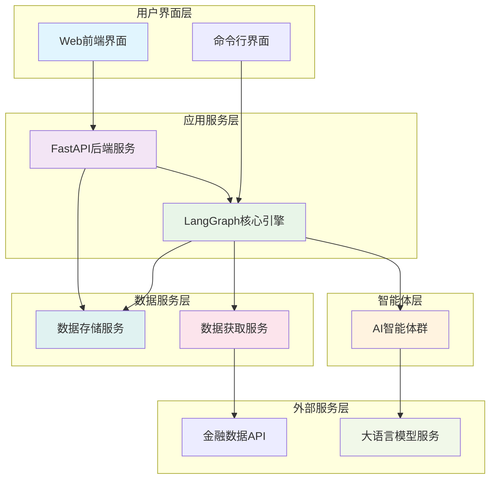
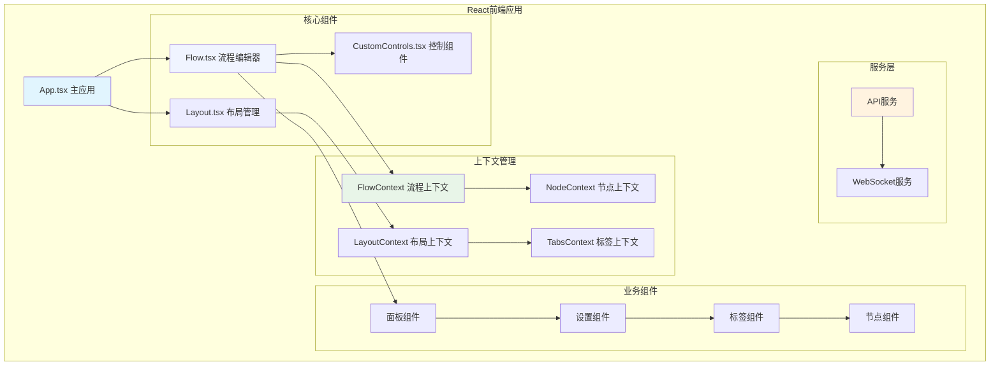
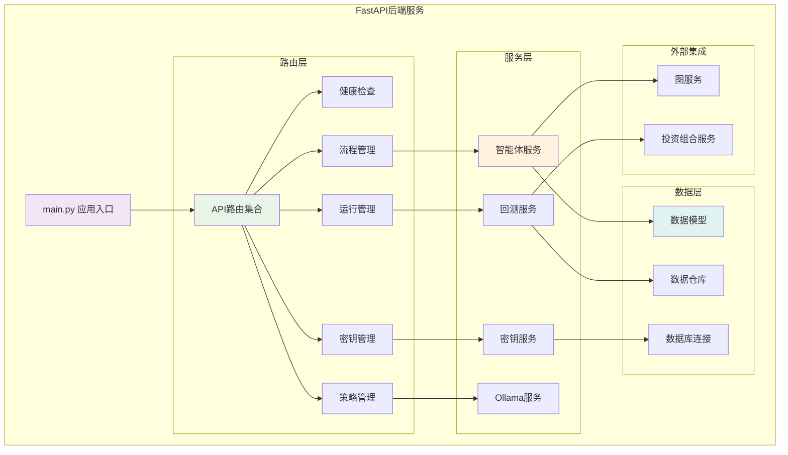
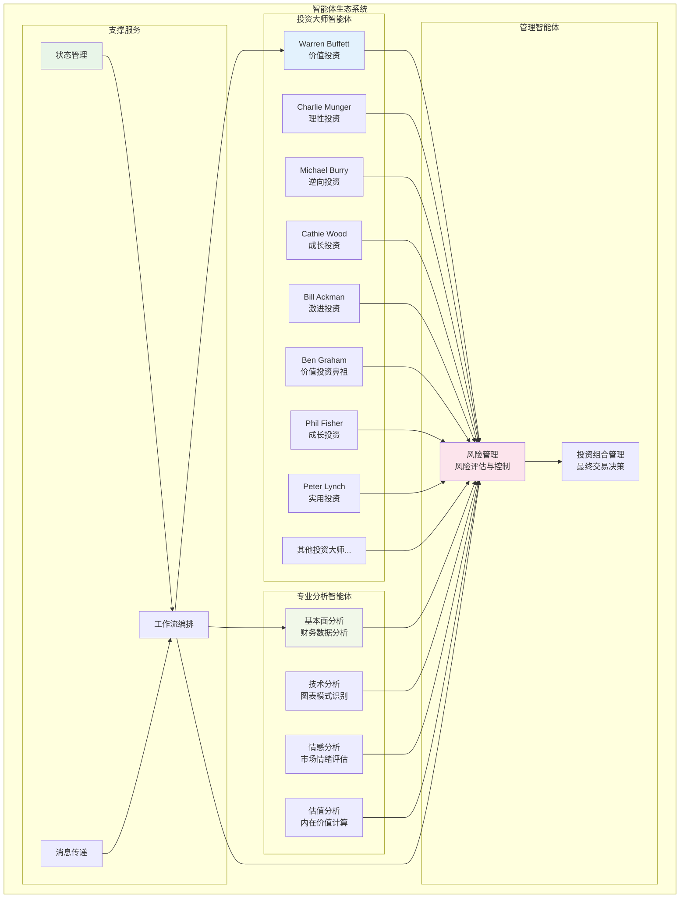
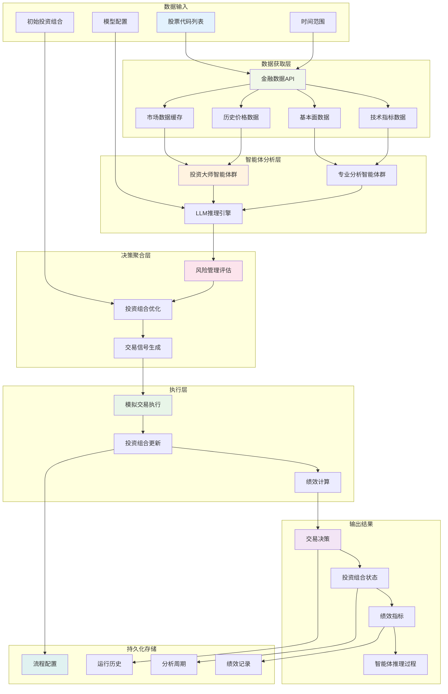
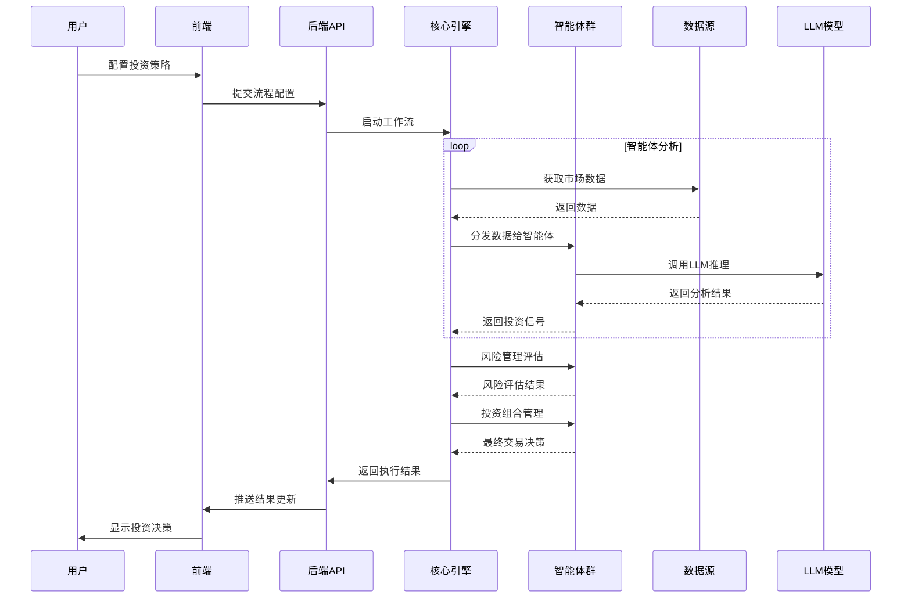

# AI对冲基金项目概述

## 项目简介

这是一个基于AI的对冲基金概念验证项目，旨在探索使用人工智能进行交易决策。该系统采用多智能体协作的方式，模拟知名投资大师的投资策略，为教育和研究目的而设计。

## 核心架构

### 1. 系统整体架构



### 2. 前端架构详图



### 3. 后端架构详图



### 4. 智能体架构详图



### 5. 数据架构详图

```mermaid
graph TB
    subgraph "数据管理系统"
        subgraph "数据获取层"
            API_CLIENT[金融数据API客户端]
            CACHE[数据缓存系统]
            VALIDATOR[数据验证器]
        end
        
        subgraph "数据处理层"
            PROCESSOR[数据处理器]
            TRANSFORMER[数据转换器]
            AGGREGATOR[数据聚合器]
        end
        
        subgraph "数据存储层"
            SQLITE[SQLite数据库]
            FLOW_TABLE[流程配置表]
            RUN_TABLE[运行记录表]
            CYCLE_TABLE[分析周期表]
            KEY_TABLE[API密钥表]
        end
        
        subgraph "数据模型层"
            AGENT_STATE[智能体状态模型]
            PORTFOLIO[投资组合模型]
            MARKET_DATA[市场数据模型]
            SIGNAL[交易信号模型]
        end
        
        subgraph "外部数据源"
            FINANCIAL_API[金融数据API]
            MARKET_FEED[市场数据源]
            NEWS_API[新闻数据API]
        end
    end
    
    FINANCIAL_API --> API_CLIENT
    MARKET_FEED --> API_CLIENT
    NEWS_API --> API_CLIENT
    
    API_CLIENT --> CACHE
    CACHE --> VALIDATOR
    VALIDATOR --> PROCESSOR
    
    PROCESSOR --> TRANSFORMER
    TRANSFORMER --> AGGREGATOR
    AGGREGATOR --> AGENT_STATE
    
    AGENT_STATE --> PORTFOLIO
    PORTFOLIO --> MARKET_DATA
    MARKET_DATA --> SIGNAL
    
    SIGNAL --> SQLITE
    SQLITE --> FLOW_TABLE
    SQLITE --> RUN_TABLE
    SQLITE --> CYCLE_TABLE
    SQLITE --> KEY_TABLE
    
    style API_CLIENT fill:#e3f2fd
    style PROCESSOR fill:#f1f8e9
    style SQLITE fill:#e0f2f1
    style AGENT_STATE fill:#fff3e0
    style FINANCIAL_API fill:#fce4ec
```



## 主要模块功能

### 1. 前端模块 (app/frontend/)
- **技术栈**: React + TypeScript + Vite
- **主要功能**:
  - 可视化流程设计器，支持拖拽式构建投资策略
  - 实时监控投资组合表现
  - 智能体配置和参数调整
  - 回测结果可视化

### 2. 后端API模块 (app/backend/)
- **技术栈**: FastAPI + SQLAlchemy + Alembic
- **主要功能**:
  - RESTful API服务
  - 数据库管理和迁移
  - 流程执行管理
  - API密钥管理

### 3. 核心引擎模块 (src/)
- **技术栈**: LangGraph + LangChain
- **主要功能**:
  - 智能体工作流编排
  - 状态管理和消息传递
  - 策略执行引擎
  - 回测系统

### 4. 智能体模块 (src/agents/)
包含18个专业投资智能体：

#### 投资大师智能体
- **Warren Buffett**: 价值投资，寻找优秀公司
- **Charlie Munger**: 理性投资，避免愚蠢决策
- **Michael Burry**: 逆向投资，寻找深度价值
- **Cathie Wood**: 成长投资，专注创新颠覆
- **Bill Ackman**: 激进投资，推动企业变革
- **其他大师**: Ben Graham, Phil Fisher, Peter Lynch等

#### 专业分析智能体
- **基本面分析**: 财务数据分析
- **技术分析**: 图表模式识别
- **情感分析**: 市场情绪评估
- **估值分析**: 内在价值计算

#### 管理智能体
- **风险管理**: 风险评估和头寸限制
- **投资组合管理**: 最终交易决策

### 5. 数据模块 (src/data/, src/tools/)
- **数据获取**: 金融数据API集成
- **数据缓存**: 提高性能和降低成本
- **数据模型**: 标准化数据结构

### 6. LLM模块 (src/llm/)
- **多模型支持**: OpenAI, Anthropic, Groq, Ollama
- **模型管理**: 动态模型选择和配置
- **成本优化**: 智能模型路由

## 数据流图



## 核心数据实体

### 1. AgentState (智能体状态)
```python
class AgentState(TypedDict):
    messages: Sequence[BaseMessage]  # 消息序列
    data: dict[str, any]            # 共享数据
    metadata: dict[str, any]        # 元数据
```

### 2. Portfolio (投资组合)
```python
portfolio = {
    "cash": float,                  # 现金余额
    "margin_requirement": float,    # 保证金要求
    "positions": {                  # 持仓信息
        ticker: {
            "long": int,            # 多头股数
            "short": int,           # 空头股数
            "long_cost_basis": float,   # 多头成本基础
            "short_cost_basis": float,  # 空头成本基础
        }
    },
    "realized_gains": dict          # 已实现收益
}
```

### 3. HedgeFundFlow (流程配置)
- 存储React Flow的节点和边配置
- 包含智能体选择和参数设置
- 支持模板化和标签分类

### 4. HedgeFundFlowRun (运行记录)
- 跟踪每次执行的完整生命周期
- 记录初始和最终投资组合状态
- 存储错误信息和绩效指标

### 5. HedgeFundFlowRunCycle (分析周期)
- 记录每个分析周期的详细信息
- 包含所有智能体的信号和决策
- 跟踪API调用成本和性能指标

## 工作流程



## 技术特点

### 1. 模块化设计
- 前后端分离架构
- 智能体可插拔设计
- 多模型支持

### 2. 可扩展性
- 支持自定义智能体
- 灵活的工作流配置
- 多种LLM模型集成

### 3. 实时性
- WebSocket实时通信
- 流式数据处理
- 增量状态更新

### 4. 可观测性
- 详细的执行日志
- 智能体推理过程可视化
- 绩效指标跟踪

### 5. 成本控制
- API调用计数
- 模型成本估算
- 缓存机制优化

## 部署方式

### 1. 命令行模式
- 直接运行Python脚本
- 适合批量处理和自动化
- 支持Docker容器化

### 2. Web应用模式
- 全栈Web应用
- 可视化界面操作
- 实时监控和管理

### 3. 混合模式
- Web界面配置策略
- 命令行执行回测
- 灵活的部署选择

## 安全考虑

- API密钥加密存储
- 环境变量配置
- 数据库访问控制
- CORS跨域保护

## 未来扩展

- 实盘交易接口集成
- 更多投资大师智能体
- 高级风险管理策略
- 机器学习模型集成
- 云端部署支持

---

*注意：本项目仅用于教育和研究目的，不构成投资建议。*
